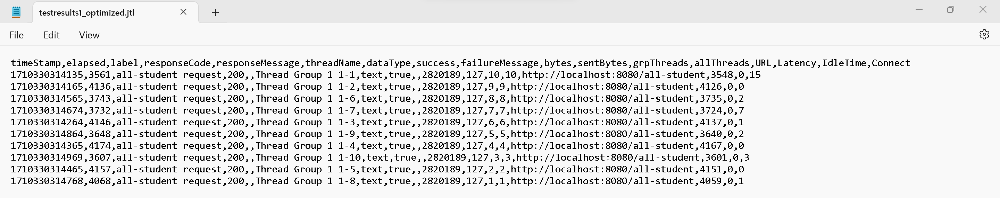

## Hasil Tes di JMeter
### Sebelum Optimalisasi
#### 1. `/all-student`
JMeter GUI

JMeter CLI

#### 2. `/all-student-name`
JMeter GUI

JMeter CLI

#### 3. `/highest-gpa`
JMeter GUI

JMeter CLI

### Setelah Optimalisasi
#### 1. `/all-student`
JMeter CLI

#### 2. `/all-student-name`
JMeter CLI

#### 3. `/highest-gpa`
JMeter CLI

### Kesimpulan
Berikut ini adalah analisis elapsed_time saat mengakses masing-masing endpoint sebelum dan sesudah dilakukan optimalisasi.
- Sebelum dilakukan optimalisasi, waktu yang diperlukan untuk memproses request ke `/all-student` berada di kisaran 150000 ms. Setelah optimalisasi, waktu yang diperlukan berada di kisaran antara 3500 dan 4100 ms.

- Sebelum dilakukan optimalisasi, waktu yang diperlukan untuk memproses request ke `/all-student-name` berada di kisaran antara 900 dan 1200 ms. Setelah optimalisasi, waktu yang diperlukan berada di kisaran 100 ms.

- Sebelum dilakukan optimalisasi, waktu yang diperlukan untuk memproses request ke `/highest-gpa` berada di kisaran antara 70 dan 140 ms. Setelah optimalisasi, waktu yang diperlukan berada di kisaran antara 5 dan 20 ms.

Berdasarkan data di atas, terdapat >20% performance improvement saat mengakses setiap endpoint. Oleh karena itu, dapat disimpulkan bahwa optimalisasi aplikasi dengan melakukan refactoring mampu memberikan dampak yang signifikan terhadap performance aplikasi secara keseluruhan.

## Reflection
#### 1. What is the difference between the approach of performance testing with JMeter and profiling with IntelliJ Profiler in the context of optimizing application performance?
Dalam melakukan performance testing, pendekatan yang digunakan oleh JMeter dan IntelliJ Profiler memiliki perbedaan yang cukup signifikan. JMeter sendiri lebih berfokus pada pengujian dari sudut pandang eksternal. Setelah JMeter mengirimkan request ke aplikasi, JMeter akan mencatat semua respons yang diterima. Di sisi lain, IntelliJ Profiler lebih berfokus pada pengujian dari sudut pandang internal aplikasi. Penggunaan IntelliJ Profiler memungkinkan developer untuk menganalisis performance di tingkat codebase, seperti memory allocation serta CPU time suatu method. 

#### 2. How does the profiling process help you in identifying and understanding the weak points in your application?
Proses profiling dapat membantu saya dalam mengidentifikasi weak point dengan berbagai cara. Melalui analisis flame graph, saya dapat melihat method mana saja yang memakan banyak resources. Selanjutnya, dengan memanfaatkan fitur timeline, saya dapat melihat pola penggunaan memory serta CPU seiring berjalannya waktu. Menurut saya, kedua fitur ini sangat membantu saya dalam mengidentifikasi berbagai kemungkinan penyebab weak point. 

#### 3. Do you think IntelliJ Profiler is effective in assisting you to analyze and identify bottlenecks in your application code?
Iya. Menurut saya, IntelliJ Profiler sangat efektif dalam mengidentifikasi bottleneck yang ada dalam aplikasi. Adanya fitur-fitur seperti flame graph dan analisis CPU time membantu saya untuk menemukan bagian kode yang memakan resources paling banyak. Hal ini sangat membantu saya untuk melakukan optimalisasi kode secara lebih efektif dan efisien.

#### 4. What are the main challenges you face when conducting performance testing and profiling, and how do you overcome these challenges?
1. Belum sepenuhnya familiar dengan fitur yang ada dalam JMeter dan IntelliJ Profiler. Untuk mengatasi hal ini, saya menyempatkan waktu untuk membaca dokumentasi yang tersedia di internet mengenai kedua testing tool. Dengan begitu, saya dapat memanfaatkan setiap fitur yang ada dengan lebih maksimal.
2. Masih sering merasa kesulitan dalam menentukan bagian kode mana yang menjadi weak point dan harus dioptimalisasi, apalagi jika aplikasi menggunakan banyak library yang tidak dapat dimodifikasi lagi. Untuk mengatasi hal ini, saya biasanya akan beberapa kali mengulang proses testing hingga saya mampu memahami pola yang muncul.

#### 5. What are the main benefits you gain from using IntelliJ Profiler for profiling your application code?
Dengan menggunakan IntelliJ Profiler, saya dapat dengan mudah mengidentifikasi bagian kode yang menjadi weak point dalam aplikasi. Tak hanya itu, IntelliJ Profiler juga memiliki fitur yang memungkinkan saya untuk mengetahui resources yang digunakan dalam setiap pemanggilan method. Adanya berbagai informasi ini sangat membantu saya dalam mengoptimalkan bagian-bagian kode yang memang perlu "perbaikan".

#### 6. How do you handle situations where the results from profiling with IntelliJ Profiler are not entirely consistent with findings from performance testing using JMeter?
Menurut saya, ada sejumlah tindakan yang bisa dilakukan jika hasil profiling di IntelliJ Profiler tidak konsisten dengan hasil performance testing di JMeter. Pertama-tama, kita perlu menyadari bahwa hasil pengujian bisa saja dipengaruhi oleh faktor-faktor eksternal seperti versi JVM. Oleh karena itu, untuk memperoleh hasil pengujian yang lebih konsisten, kita dapat mempertimbangkan penggunaan container seperti Docker sebelum mulai menjalankan pengujian. Diharapkan dengan begitu, hasil pengujian yang diperoleh akan lebih akurat karena tidak terpengaruh oleh perbedaan versi JVM.

#### 7. What strategies do you implement in optimizing application code after analyzing results from performance testing and profiling? How do you ensure the changes you make do not affect the application's functionality?
Setelah selesai melakukan performance testing serta profiling, langkah pertama yang akan saya lakukan adalah mengevaluasi waktu yang dibutuhkan oleh aplikasi dalam merespons request dari JMeter. Jika waktu yang dibutuhkan terlalu lama, langkah selanjutnya yang akan saya lakukan adalah menganalisis hasil profiling dari IntelliJ Profiler untuk mengidentifikasi weak point dalam aplikasi. Setelah itu, dengan memanfaatkan hasil profiling tadi, saya akan "memperbaiki" bagian kode yang sekiranya menjadi weak point. Untuk memastikan perubahan yang dilakukan tidak berpengaruh terhadap fungsionalitas aplikasi, saya akan membuat serta memanfaatkan unit test. Sesuai dengan penjelasan modul di pekan sebelumnya, penggunaan unit test dapat sangat membantu developer dalam melakukan refactoring karena developer tidak perlu lagi melakukan testing secara manual.